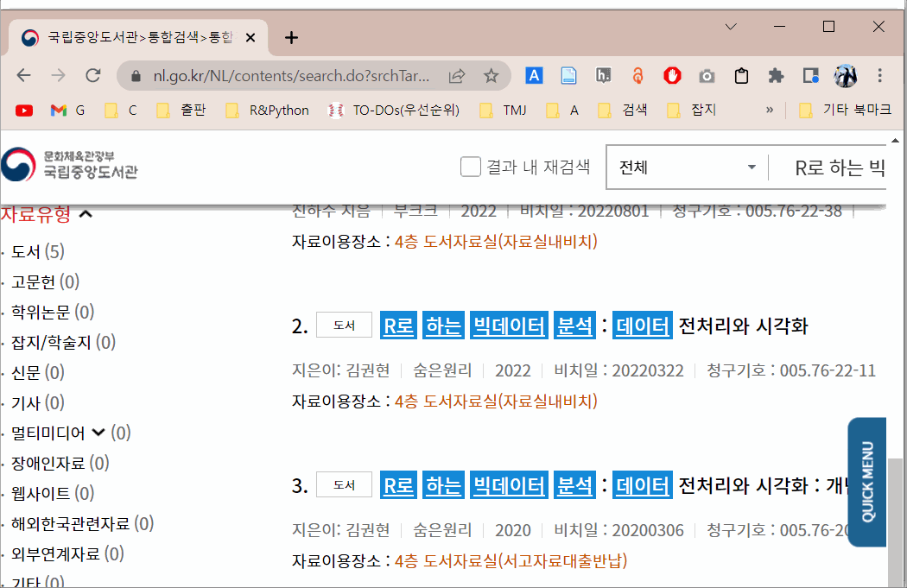
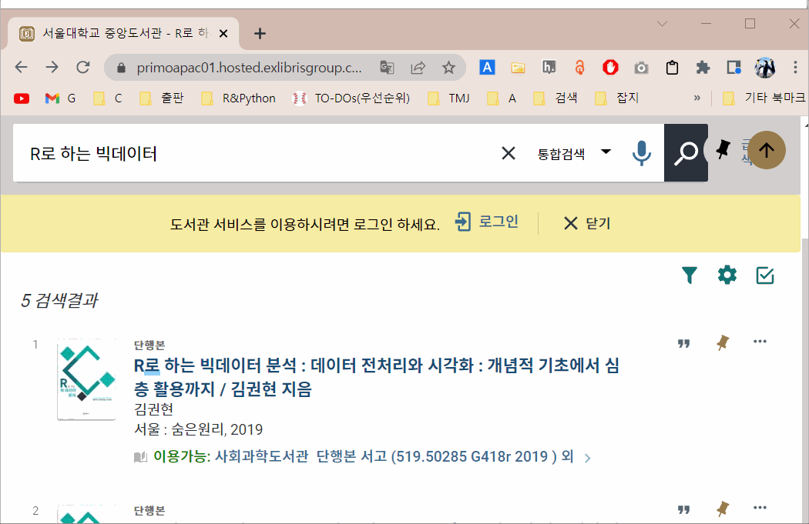
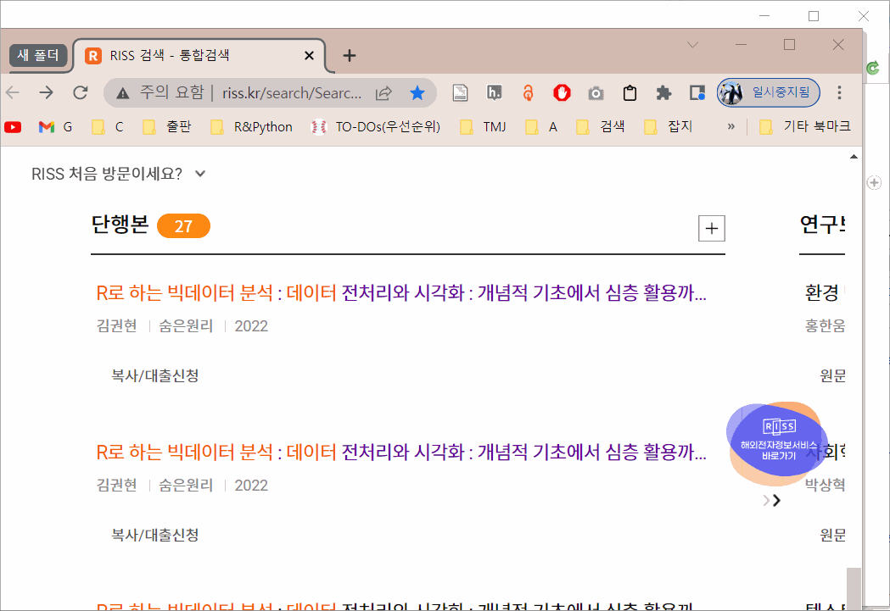

## RISS Zotero translator

* Zotero translator는 zotero를 지원하지 않는 웹사이트에서 인용 정보를 zotero로 쉽게 불러들이기 위해 사용한다.

* 사용방법 : RISS translator(`RISS.js`)를 Zotero의 환경설정 - 고급 - 파일 및 폴더 - 저장 위치 의 하위 폴더 `translator`에 복사한다.
  - [참고 동영상](https://www.youtube.com/watch?v=nc7TEFEbhpA&ab_channel=erazlogo)

## Zotero 지원 현황

* 우리나라의 많은 도서관에서 Zotero를 지원하지 않아서 도서를 인용할 때 불편하다.
  - [한국학술지인용색인(KCI)](https://www.kci.go.kr/kciportal/main.kci)는 학술지 인용 색인 정보를 제공하고 있으며 Save to Zotero를 지원하지만, 모든 정보가 영어로 저장되는 단점이 있어보인다.
  
* 예를 들어 [국립중앙도서관](nl.go.kr)에서 검색을 한 후 크롬에서 Save to Zotero 플러그인을 실행하면 도서 정보가 제대로 저장되지 않는다.



* Save to Zotero가 제대로 작동하는 사이트로는 [서울대학교 도서관](https://lib.snu.ac.kr/)과 [포항공대 도서관](https://library.postech.ac.kr/) 등이 있다. 하지만 대학교 도서관은 보유 도서가 제한적일 것이다. 그리고 저장되는 정보를 확인해 보면 도서 제목이 정확하게 저장되지 않고 있었다. 



* 그래서 Zotero translator를 활용하여 [RISS](http://www.riss.kr/index.do)에서 도서정보를 Zotero로 저장할 수 있는 방법를 개발하였다. 

## Zotero translator 개발기

* Zotero translator에 대한 기본적인 정보는 [Zotero Documentation: Writing Translator Code](https://www.zotero.org/support/dev/translators/coding)에서 확인할 수 있다. (관련된 부분은 Web Translator이다.)
  - JavaScript로 작성한다.
  - `detectWeb()` 함수는 현재 사이트에서 정보를 추출할 수 있는지를 확인하고,
  - `doWeb()` 함수에서 사이트의 정보를 추출한다.
  
* [How to Write a Zotero Translator](https://niche-canada.org/member-projects/zotero-guide/chapter1.html)란 사이트도 도움이 되었다.

## 개발 관련 몇 가지 팁

* Zotero translator를 수정한 후 실시간으로 적용이 되지 않기 때문에 크롬을 종료하고 다시 실행해야 한다. 시간이 너무 오래 걸려서 Save to Zotero를 적용한 페이지를 `.html`로 저장한 후 `</body>` 직전에 `<script src="zot.js"></script>`를 추가하고, `zot.js`에 필요한 코드를 작성하면서 `console.log()`로 필요한 변수를 출력하였다. 이때 `doc` 대신 `document`를 사용해야 한다. 

* 저장 정보 입력 시 서양 이름과 다르게 한국 이름은 한 칸으로 저장하는 게 자연스러운데 이름을 한 칸에 저장하는 방법을 몰라서 그냥 두 칸 중 첫 칸에 저장했다. `한 칸으로 전환` 버튼을 누르면 쉽게 변경할 수 있다. 



* 도서 정보 필드 이름에 대한 정확한 공식 문서가 없어서 고생했다. Zotero에서 제공하는 다른 translator 파일(`.js`)를 참조하여 확인한 필드 이름은 다음과 같다.
  
```
       abstracteNote 	        abstractNote 	            accepted 	
          accessDate 	     accessionNumber 	   additionalformats 	
             address 	   applicationNumber 	             archive 	
           archiveID 	     archiveLocation 	       artworkMedium 	
         artworkSize 	            assignee 	         attachments 	
audioRecordingFormat 	          billNumber 	           blogTitle 	
           bookTitle 	          callNumber 	            caseName 	
             charset 	                city 	                code 	
          codeNumber 	           committee 	      conferenceName 	
       contextObject 	         continuedby 	             country 	
               court 	            creators 	                date 	
         dateDecided 	         dateEnacted 	         distributor 	
        docketNumber 	      documentNumber 	                 DOI 	
             edition 	               email 	   encyclopediaTitle 	
               extra 	          filingDate 	           firstPage 	
          forumTitle 	             history 	         institution 	
                ISBN 	                ISSN 	               issue 	
           issueDate 	              itemID 	            itemType 	
 journalAbbreviation 	        jurisdiction 	               label 	
            language 	        lastModified 	     legislativeBody 	
      libraryCatalog 	        locInArchive 	              medium 	
         meetingName 	            mimeType 	           nameOfAct 	
             network 	                note 	               notes 	
              number 	     numberOfVolumes 	            numPages 	
                page 	               pages 	        patentNumber 	
                path 	               place 	            postType 	
    presentationType 	     priorityNumbers 	 programmingLanguage 	
        programTitle 	         publication 	    publicationTitle 	
     publicLawNumber 	           publisher 	          references 	
            reporter 	      reporterVolume 	        reportNumber 	
          reportType 	          repository 	              rights 	
         runningTime 	               scale 	             section 	
             seeAlso 	              series 	        seriesNumber 	
          seriesText 	         seriesTitle 	             session 	
          shortTitle 	              source 	              system 	
                tags 	           telephone 	          thesisType 	
               title 	                type 	          university 	
                 url 	       versionNumber 	videoRecordingFormat 	
              volume 	        websiteTitle 	         websiteType
```

* 확인 결과 [zotero github](https://github.com/zotero/zotero/blob/master/chrome/locale/ko-KR/zotero/zotero.properties)에서도 확인 가능하다.

## History

* 2022-10-13 : mac에서 작동 확인(BigSur, Safari)


